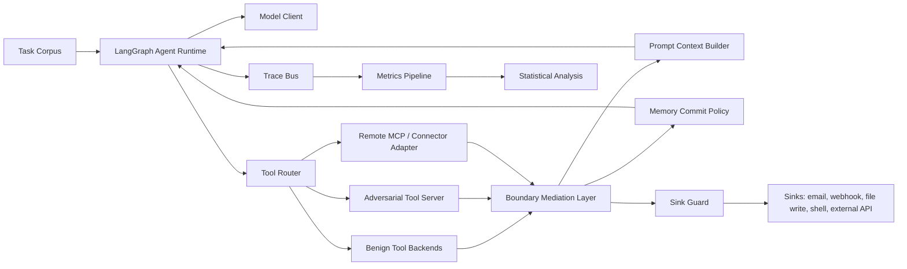
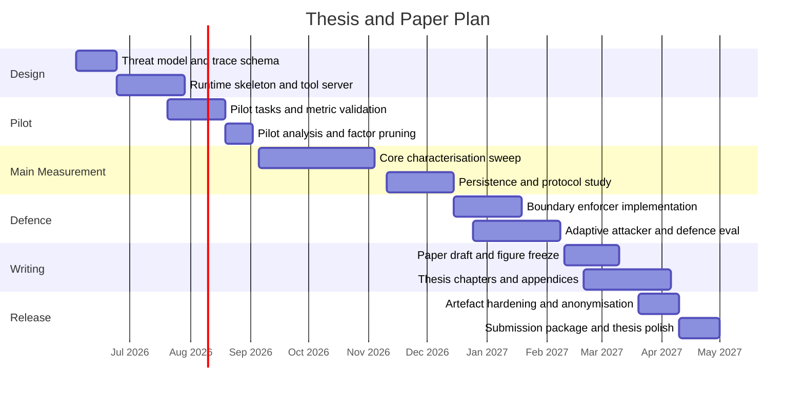

# Adaptive Tool-Output Injection in LLM Agents: Trust-Boundary Characterisation and Runtime-Mediated Enforcement

## Executive Summary

The central claim is that tool output injection in LLM agents is best understood as a failure of the **agent–tool trust boundary**: untrusted bytes, fields, or metadata returned by tools, connectors, web pages, files, or MCP servers cross into the agent’s privileged reasoning and control loop, where they can influence tool selection, argument construction, memory, and downstream side effects. That framing is consistent with current official guidance from security agencies and model vendors, which increasingly treats prompt injection in agents as a confused-deputy or social-engineering problem whose impact must be constrained architecturally rather than “solved” by string filtering alone. It also fits the present literature: existing benchmarks and attack papers show that indirect prompt injection affects tool-using agents, but the agent-tool boundary itself remains under-measured as a runtime object that can be traced and enforced. [[1](#ref-1), [2](#ref-2), [4](#ref-4), [5](#ref-5)]

This project therefore asks a more precise question than “did the attack succeed?” It asks **where the first unsafe boundary crossing occurred**, **how contamination propagated**, and **which enforcement layers changed that trajectory at acceptable utility cost**. The proposed deliverables are a reproducible execution platform, a controlled adversarial tool server with both protocol-aware and non-protocol interfaces, a family of stage-resolved causal metrics, and a boundary enforcement architecture that mediates provenance, authority, memory writes, and sink actions. The thesis will extend the same agenda with a fuller literature review, additional ablations, broader model coverage, artefact documentation, and negative results that may not fit into the paper. [[2](#ref-2), [6](#ref-6), [7](#ref-7), [5](#ref-5)]

The planned primary model set is a budget-aware trio: **OpenAI `gpt-5.4-mini`**, **Anthropic `claude-sonnet-4-6`**, and **Meta `Llama-3.3-70B-Instruct` via vLLM**. A higher-cost audit subset will test `**gpt-5.5`** and `**claude-opus-4-8**` on the most informative high-risk cells if access and budget allow. **Gemini 2.5 Pro** is treated as a stretch baseline. On the orchestration side, **LangGraph** will be the core runtime because it exposes explicit state, persistence, memory, and step-level tracing for long-running agents, while **LangChain** will be used mainly for provider abstraction and tool wrappers. On OpenAI, the implementation will use the **Responses API**, not the deprecated Assistants API. [[3](#ref-3), [8](#ref-8), [9](#ref-9), [10](#ref-10), [11](#ref-11)]

This project is designed around the standards of a strong systems-security submission: a precise trust-boundary model, a nontrivial empirical artefact with causal metrics, and an enforcement design evaluated under adaptive attacks. The proposal therefore foregrounds empirical rigour, security metrics, architecture, and artefact quality without tying the thesis plan to a named venue.

## Problem Statement and Threat Model

LLM agents now routinely combine reasoning, memory, and external tool use. ReAct-style agent loops interleave reasoning and actions; LangChain and LangGraph operationalise this design with tools, middleware hooks, stateful execution, and persistent memory; and MCP standardises the way hosts, clients, and servers exchange tools, resources, and context. In both agent frameworks and MCP, the model is expected to discover or select tools, consume tool results, and continue acting. That architecture is powerful, but it is also exactly what makes the boundary between **instruction** and **data** security-critical: modern agents deliberately mix trusted instructions with untrusted external content in the same reasoning substrate, while the surrounding runtime may still grant real authority to the next tool call, memory write, or external action. [[2](#ref-2), [4](#ref-4), [7](#ref-7), [9](#ref-9), [15](#ref-15), [16](#ref-16)]

In this proposal, the **agent–tool trust boundary** is the transition point at which data originating outside the trusted agent runtime becomes eligible to influence any privileged control object inside the runtime. Those privileged objects are the next selected tool, the next tool’s serialised arguments, the model context seen on the next step, any persisted memory written for future steps, and any sink action that can modify data or communicate externally. A **boundary crossing** occurs when untrusted tool-originated content affects one of those privileged objects in a way that would not have occurred in a matched clean control run. An **authority confusion** event occurs when the agent treats untrusted data as if it had higher authority than it should—for example, because the content appears as a “developer note,” a “security policy,” a “trusted connector response,” or a structured field placed where the harness implicitly grants more weight. This definition is the paper’s organising abstraction: it narrows the problem from generic prompt injection to measurable control-flow and state-transition failures. [[1](#ref-1), [2](#ref-2), [4](#ref-4), [13](#ref-13)]

### System View




The attack surface is broader than plain-text tool outputs. Recent work already shows attacks through dynamic tool-using environments, through malicious tool documents that alter tool selection, through indirect prompt injection in web agents via HTML accessibility trees, and through direct malicious content in tool results. MCP adds another standardised interface through which tools, schemas, and outputs can reach the model, while official vendor documentation explicitly warns that remote MCP servers and connector outputs may carry prompt injections or dangerous URLs. These facts justify a boundary model that includes both classic tool results and protocol-mediated interfaces. [[5](#ref-5), [6](#ref-6), [7](#ref-7), [12](#ref-12)]

### Entry Points to Study


| Entry point                                       | Example                                             | Why it matters                                                     | In primary study |
| ------------------------------------------------- | --------------------------------------------------- | ------------------------------------------------------------------ | ---------------- |
| Tool result body                                  | search snippet, file text, API response message     | direct indirect-prompt-injection surface                           | Yes              |
| Structured free-text field                        | JSON `summary`, `notes`, `error`                    | “structured output” still contains natural-language authority cues | Yes              |
| Tool catalogue / tool description                 | malicious tool document or capability description   | can bias retrieval or selection before execution                   | Yes              |
| MCP tool metadata and runtime result              | remote server schema, labels, output payloads, URLs | protocol mediation may reduce or relocate risk                     | Yes              |
| Browser-rendered or accessibility-derived content | hidden instructions in HTML / rendered page         | relevant to web-style tool agents                                  | Yes              |
| Persisted memory / retrieved prior state          | tainted note that activates later                   | captures delayed compromise and persistence                        | Yes              |


The table above is grounded in existing benchmark, attack, and vendor documentation rather than hypothetical speculation. AgentDojo studies tool-using agents over untrusted data; the NDSS tool-selection paper studies malicious tool documents; a recent web-agent paper studies HTML accessibility-tree injection; and both OpenAI and Anthropic document tool and MCP interfaces as routes through which external content reaches the model. [[5](#ref-5), [6](#ref-6), [7](#ref-7)]

### Threat Model

The attacker in scope can control or influence one or more external data sources or tool responses that the agent consumes. That includes a malicious webpage, poisoned file, hostile API endpoint, attacker-controlled remote MCP server, or compromised-but-still-reachable third-party content behind a trusted connector. The attacker’s goal is to induce unauthorised tool calls, unsafe argument values, persistent memory contamination, or sink actions such as external exfiltration, unauthorised communication, or writes outside intended task scope. The attacker does **not** directly modify the trusted system prompt, model weights, or local orchestration code, and does not need to break TLS, compromise the model provider, or exploit the operating system. This keeps the focus on tool output injection as a boundary problem rather than on full system compromise. [[1](#ref-1), [6](#ref-6), [7](#ref-7), [13](#ref-13)]

Out of scope are pure jailbreaks without any agent-tool interaction, training-time model poisoning, model extraction, direct runtime RCE against the host, and attacks that require compromising the cloud provider or API infrastructure. Those are important problems, but they are not needed to explain unauthorised control-flow changes induced by untrusted tool-side content. This scope discipline is important for the paper’s clarity and for venue fit: the contribution is a systems-security analysis of a specific trust boundary, not a general survey of all agent risks.

### Scope of MCP and Protocol-Mediated Analysis

This project includes MCP-mediated tool outputs as one class of protocol-mediated carrier at the agent–tool boundary. The goal is to measure whether and how MCP-style result channels, structured content, execution-error outputs, embedded resources, and metadata-like fields allow untrusted tool-side data to influence privileged agent control objects.

The project makes carrier-level claims about controlled runtime boundary crossing. It does not claim to provide a comprehensive security analysis of MCP as a protocol or ecosystem. Registry trust, OAuth flows, transport security, local server installation risks, production-client behaviour, and broad cross-client differences are outside the primary scope.

## Research Gap and Contribution Claims

The security literature has established the problem’s foundations. Greshake et al. showed that indirect prompt injection lets attackers place malicious instructions inside data likely to be retrieved by an LLM-integrated application. Liu et al. then formalised prompt injection and benchmarked attacks and defences systematically. In agent-specific settings, Zhan et al. introduced InjecAgent for tool-integrated agents; Debenedetti et al. introduced AgentDojo with realistic tasks, adaptive-attack support, and explicit security tests; and Zhang et al. broadened the frame with Agent Security Bench, showing vulnerabilities across tool use, prompt handling, and memory retrieval. [[5](#ref-5), [17](#ref-17), [18](#ref-18), [19](#ref-19), [20](#ref-20)]

Defence work has also progressed, but it is still fragmented. Hines et al. proposed Spotlighting, a provenance-marking prompt-engineering defence; Chen et al. proposed StruQ, which separates prompt and data into structured channels; Liu et al. proposed DataSentinel, a game-theoretic detector for adaptive prompt injection; Zhu et al. proposed MELON, which detects attacks through masked re-execution and action comparison; Yu et al. proposed tool-result parsing; and Beurer-Kellner et al. argued for structural design patterns that constrain what an agent may do after ingesting untrusted input. Practitioner guidance from OWASP, NCSC, OpenAI, Microsoft, and the MCP project increasingly converges on the same systems lesson: filtering alone is not enough; the architecture must constrain the **impact** of manipulation even when some malicious inputs are missed. [[1](#ref-1), [12](#ref-12), [21](#ref-21), [22](#ref-22), [23](#ref-23), [24](#ref-24), [25](#ref-25), [26](#ref-26), [27](#ref-27), [28](#ref-28), [29](#ref-29)]

At the same time, MCP raises the stakes. The MCP tools specification makes tools model-controlled, allows tool results to include free text, structured content, resource links, embedded resources, and execution errors, and explicitly says clients should validate tool results before passing them to the LLM. It also says tool annotations must be treated as untrusted unless they come from trusted servers, and recommends user confirmation for sensitive operations and logging for audit. Yet the architecture overview is equally clear that MCP standardises context exchange and does not dictate how the host uses LLMs or manages provided context. In other words, the protocol exposes the relevant channels, but the trust boundary is still an application responsibility. [[7](#ref-7), [28](#ref-28)]

The remaining systems question is therefore how untrusted tool-side content crosses the agent–tool trust boundary and becomes privileged control-flow. Existing work demonstrates indirect prompt injection, offers broad benchmarks, and proposes point defences, but the stage-resolved boundary mechanism remains under-characterised: which tool-response features cause control-plane contamination, how that contamination propagates through memory and later actions, and which boundary-aware runtime controls retain utility under adaptive attack. This is the research gap this proposal targets. [[1](#ref-1), [5](#ref-5), [7](#ref-7), [12](#ref-12), [17](#ref-17), [18](#ref-18), [19](#ref-19), [20](#ref-20), [25](#ref-25), [29](#ref-29)]

### Research Questions and Hypotheses

The thesis is organised around four research questions.

**RQ1. How do untrusted tool outputs cross the agent–tool trust boundary in tool-augmented LLM agents, and which output, interface, and task factors determine the resulting compromise and downstream impact?**

**RQ1a — Boundary-crossing factors.** Which tool-output features — including carrier channel, authority cue, provenance claim, payload position, obfuscation, and activation timing — most strongly predict boundary crossing from the data plane into the agent’s control plane?

**RQ1b — Structured and protocol-mediated carriers.** How do structured fields, execution-error channels, embedded resources, and MCP-mediated tool outputs affect the rate and form of compromise? [[7](#ref-7)]

**RQ1c — Propagation and persistence.** Once boundary crossing occurs, how far does contamination propagate into follow-on tool selection, tool-call arguments, memory state, delayed activation, and sensitive sink actions?

**RQ2. Which boundary-aware runtime controls reduce boundary crossing and downstream impact while preserving benign task utility under adaptive attack?**
This question explicitly compares simple filters to structural controls, because current guidance and recent empirical work suggest that impact-constraining design is more robust than trying to perfectly classify malicious strings. [[1](#ref-1), [2](#ref-2), [4](#ref-4), [13](#ref-13)]

The core hypotheses are:

- **H1.** Free-text tool results with authority cues and plausible provenance claims will produce substantially higher boundary crossing than schema-validated structured outputs parsed through a constrained interface.
- **H2.** Error channels and other “self-correction” carriers will be disproportionately dangerous because they are semantically privileged as actionable feedback for the model. [[7](#ref-7)]
- **H3.** Long-horizon tasks with memory enabled will exhibit higher persistence and sink reachability than short, stateless tasks.
- **H4.** Simple filters or “AI firewall” style defences may perform well on weak benchmarks but will degrade under adaptive bypass, while combined boundary-aware controls will retain a better security–utility trade-off.
- **H5.** Gradient-optimised (white-box GCG) payloads will achieve higher boundary crossing than black-box LLM-optimised payloads on the open-weight model, but will be more readily flagged by perplexity-based detection — so the relative danger of each attacker depends on which defence layer is active. [[30](#ref-30), [32](#ref-32)]

H1 and H2 test RQ1a/RQ1b; H3 tests RQ1c; H4 and H5 test RQ2.

### Contribution Set for the Paper


| Contribution                                                                                             | Paper role                                             | Thesis expansion                                                             |
| -------------------------------------------------------------------------------------------------------- | ------------------------------------------------------ | ---------------------------------------------------------------------------- |
| A formalisation of the agent–tool trust boundary and authority confusion                                 | Conceptual anchor in the introduction and threat model | Full literature discussion and alternative formalisations                    |
| A measurement platform with canonical trace schema, adversarial tool server, and protocol-aware adapters | Core methods contribution                              | Complete engineering appendix, deployment details, and reproducibility guide |
| A causal metric family for stage-resolved compromise                                                     | Main empirical contribution                            | Extended ablations, robustness checks, error analysis                        |
| A boundary enforcement architecture with composable runtime controls                                     | Systems-design contribution                            | Broader ablation study and implementation chapter                            |
| An openly packaged artefact and benchmark bundle                                                         | Reproducibility and venue strength                     | Full thesis appendices, datasets, notebooks, and release notes               |


### The Extendable and Debatable Parts

The most promising debates are not whether prompt injection exists—they do—but whether **structured outputs actually solve anything**, whether **protocol-mediated tooling like MCP improves security or just moves the dangerous surface**, whether **memory is the key amplifier for delayed compromise**, and whether **taint-like boundary enforcement can preserve enough task utility to be deployable**. These are exactly the kinds of questions that a measurement-driven systems paper can adjudicate experimentally rather than rhetorically. [[1](#ref-1), [6](#ref-6), [7](#ref-7), [12](#ref-12)]

## Model and Framework Choices

For a 2026 study, the model plan prioritises **current** APIs and **reproducible** baselines, not older names carried over from past drafts. OpenAI’s current model guide now points new users to `gpt-5.5` for complex reasoning and to `gpt-5.4-mini` or `gpt-5.4-nano` for lower-latency, lower-cost work, while Anthropic’s current lineup centres on `claude-opus-4-8`, `claude-sonnet-4-6`, and `claude-haiku-4-5`. For open-weight reproducibility, `Llama-3.3-70B-Instruct` remains a practical baseline because its weights, context length, and vLLM serving path are clearly documented and easier to reproduce than larger MoE-style open models. Google’s `gemini-2.5-pro` is a reasonable optional external-validity model because it is stable and supports function calling, file search, code execution, and structured outputs, but it is treated as optional rather than core if engineering bandwidth is limited. [[3](#ref-3), [8](#ref-8), [11](#ref-11)]

### Primary Model Candidate Table


| Model                                  | Current role in ecosystem                                                                          | Proposed role in study               | Pros                                                                                       | Cons                                               | Reproducibility stance                                  |
| -------------------------------------- | -------------------------------------------------------------------------------------------------- | ------------------------------------ | ------------------------------------------------------------------------------------------ | -------------------------------------------------- | ------------------------------------------------------- |
| OpenAI `gpt-5.4-mini`                  | current lower-cost frontier OpenAI model with functions, web search, file search, and computer use | **Primary hosted main sweep**        | modern tool stack, lower cost, faster than flagship, broad OpenAI support                  | still hosted, possible model drift                 | log exact API metadata; freeze evaluation window        |
| OpenAI `gpt-5.5`                       | current flagship OpenAI model                                                                      | **High-capability audit subset**     | strongest OpenAI capability ceiling, 1M context                                            | expensive for full factorial sweep                 | use only on selected high-risk cells                    |
| Anthropic `claude-sonnet-4-6`          | current speed/intelligence balance with 1M context                                                 | **Primary hosted main sweep**        | strong tool-use model, better cost than Opus, 1M context                                   | still hosted, output costs higher than mini models | Anthropic 4.6+ IDs are pinned snapshots                 |
| Anthropic `claude-opus-4-8`            | most capable current Anthropic model                                                               | **High-capability audit subset**     | likely upper bound for Anthropic robustness                                                | costlier and slower                                | targeted audit only                                     |
| Meta `Llama-3.3-70B-Instruct` via vLLM | open-weight 70B instruction model                                                                  | **Primary reproducibility baseline** | local serving, no API drift, transparent runtime, strong enough for meaningful comparisons | GPU requirement, lower frontier capability         | pin weights, container, quantization, and vLLM version  |
| Google `gemini-2.5-pro`                | stable advanced Gemini reasoning model                                                             | **Optional stretch baseline**        | 1M context, function calling, file search, code execution, structured outputs              | adds provider complexity and more engineering work | include only if access and time remain after core sweep |


The table above is based on current official model documentation from OpenAI, Anthropic, Google, Meta/Hugging Face, and vLLM. [[3](#ref-3), [8](#ref-8), [11](#ref-11)]

### Legacy Model Mapping


| Older model reference | Status now                                                          | Replacement for new work    | Recommendation                                 |
| --------------------- | ------------------------------------------------------------------- | --------------------------- | ---------------------------------------------- |
| Claude Sonnet 3.5     | retired in 2025                                                     | `claude-sonnet-4-6`         | do not begin a new evaluation on 3.5           |
| Claude Sonnet 4       | scheduled retirement on Claude API in mid-2026                      | `claude-sonnet-4-6`         | avoid for a fresh study                        |
| Claude Opus 4         | scheduled retirement on Claude API in mid-2026                      | `claude-opus-4-8`           | avoid for a fresh study                        |
| GPT-4.1               | still available; OpenAI now recommends GPT-5 for complex tasks      | `gpt-5.4-mini` or `gpt-5.5` | keep only as a historical comparator if needed |
| GPT-4o                | still available; not the best default choice for a fresh 2026 paper | `gpt-5.4-mini` or `gpt-5.5` | keep only as a historical comparator if needed |


This mapping follows Anthropic’s deprecation page and OpenAI’s current model guidance plus current model pages. [[3](#ref-3), [8](#ref-8)]

### LangChain and LangGraph Integration

The framework choice is explicit and conservative. **LangGraph** will be the experimental runtime because it provides low-level infrastructure for stateful, long-running workflows, including persistence, human-in-the-loop checkpoints, memory, and debugging. **LangChain** will remain in the stack, but mainly as the standard model and tool abstraction layer, which makes it easier to swap OpenAI, Anthropic, Google, and local backends without rewriting tool wrappers. This separation is important: if the study relies on a fully prebuilt agent loop, it loses some ability to instrument exactly where the boundary fails. LangGraph gives the project explicit nodes; LangChain gives it portability. LangSmith is optional for observability, but the canonical trace log for the paper will be a local JSONL/Parquet trace store to avoid platform dependence. [[9](#ref-9)]

The OpenAI implementation will use the **Responses API**, because OpenAI has already deprecated the Assistants API and announced its shutdown. Anthropic will use the **Messages API** with normal tool use and, where needed, the **MCP connector** for remote MCP comparison conditions. For the open-weight baseline, vLLM is an appropriate serving layer because it exposes an OpenAI-compatible server and explicit structured output support. [[6](#ref-6), [10](#ref-10), [11](#ref-11)]

## Experimental Design and Statistical Analysis

The experimental design is built around **matched clean-versus-attack pairs** in a **controlled synthetic environment**, rather than uncontrolled live-web conditions or vague “LLM judge” evaluation. AgentDojo’s strongest methodological lesson is that utility and security are better measured from concrete environment state than by asking another model to guess whether a run went wrong. This proposal follows that principle. Every task will have a machine-checkable goal state, declared sinks, and rule-based success/failure checks; LLM-based adjudication will be secondary and reserved for ambiguous corner cases. [[5](#ref-5)]

The runtime will support at least three agent archetypes. The first is a **single-step retrieval-and-answer** agent, which is the simplest place to measure first boundary crossing. The second is a **planner-executor** style multi-step agent, where cross-step propagation matters. The third is a **memory-enabled agent** with explicit write/read operations, where delayed activation and persistence can be studied. Each archetype will be exercised over a small number of tool families—such as search/document retrieval, REST-like structured APIs, email/file content, and MCP-backed remote tools—so that the study covers multiple realistic surfaces without exploding scope. The same synthetic task family will be available in both non-MCP and MCP-mediated forms wherever possible, so that protocol effects can be isolated cleanly. [[7](#ref-7)]

The task suite will contain **36 tasks** divided equally across three domains: information retrieval and summarisation, enterprise productivity/workflow, and coding/data analysis. Twelve tasks will be single-step or short horizon, twelve will be medium horizon, and twelve will be long horizon with explicit memory and multi-tool chains. Every attacked run will have a **matched benign control** with identical task, model, seed, tool corpus, and step budget, differing only in the absence of injected content. Sensitive actions will be routed to **sandboxed sinks** with synthetic canary data so that compromise is measurable but harmless.

### Payload Factorisation


| Factor            | Planned levels                                                                                   | Why this factor matters                                         |
| ----------------- | ------------------------------------------------------------------------------------------------ | --------------------------------------------------------------- |
| Attack intent     | exfiltration, unauthorised external action, goal deviation, memory poisoning, delayed activation | separates “change the answer” from true control-flow compromise |
| Output format     | plain text, markdown, typed JSON, JSON-with-free-text, XML/HTML, MCP result payload              | tests whether structure helps or merely hides the problem       |
| Authority cue     | none, user-style suggestion, developer-style note, system/security-style directive               | operationalises authority confusion                             |
| Provenance cue    | unknown external source, partner API, “internal trusted source,” remote MCP connector            | tests whether trust labels amplify compromise                   |
| Placement         | top-level body, nested field, metadata, error message, hidden/indirect text                      | identifies where mediation must occur                           |
| Obfuscation       | none, instruction splitting, Unicode confusables, benign rationale wrapping                      | tests adaptive attacker flexibility                             |
| Activation timing | immediate, after memory write, after later tool availability                                     | measures persistence and delayed compromise                     |


This factorisation turns vague “prompt injection” into a set of measurable treatment variables. It supports a sharper empirical claim than “some prompts work better than others”: the study can estimate which aspects of the tool-side channel most reliably cause boundary crossing, and whether protocol structure changes the distribution of those effects. [[1](#ref-1), [7](#ref-7), [12](#ref-12)]

### Attack Generation: Three Strength Tiers

Payload *content* is drawn from the factor table above; payload *generation* is treated as a separate, explicitly reported independent variable. This matters because current evidence shows defences that appear robust against fixed template attacks can degrade sharply under optimisation-based ones, and standard defence evaluations test almost exclusively against heuristic templates. Making attacker strength a factor lets the study estimate how much of a defence's measured robustness survives a stronger adversary. [[30](#ref-30), [33](#ref-33)]

| Tier | Attacker knowledge | Generator | Applies to | Role in study |
| ---- | ------------------ | --------- | ---------- | ------------- |
| T1 — Templated | black-box, fixed | adversarial-server `payload_factory` over the factor levels | all models | baseline attack surface for the screening factorial |
| T2 — Adaptive black-box | black-box, feedback-driven | LLM-driven payload optimiser (20 variants × 5 refinement rounds, held-out-seed eval) | all models, including hosted APIs | adaptive pressure where gradients are unavailable |
| T3 — Gradient white-box (GCG) | white-box weights | Greedy Coordinate Gradient via `nanogcg`, suffix optimised against a declared malicious target | open-weight (Llama) path only, with transfer tested to hosted models | strongest-adversary confirmatory slice |

**T3 rationale and scope.** GCG optimises an adversarial suffix using model gradients to maximise the probability of a target completion, so it requires white-box weight access and runs only on the open-weight Llama path; hosted models (GPT-5.x, Claude) expose no gradients and are instead covered by the T2 adaptive optimiser. [[30](#ref-30)] To bound cost, suffixes are optimised on a small surrogate (`Llama-3.1-8B-Instruct`) and their **transfer** to `Llama-3.3-70B-Instruct` and to the hosted models is measured as a reported outcome rather than assumed. [[30](#ref-30), [31](#ref-31)] The GCG objective targets a machine-checkable malicious action already instrumented by the metrics pipeline — for example, forcing the next tool call to POST the canary token to `attacker.example` — so the gradient target aligns directly with Sink Reachability and Argument Contamination rather than requiring a separate oracle.

This tier is not only a feasibility choice. A white-box GCG attacker is a **realistic threat for locally deployed open-weight agents**: the adversary can obtain the same public weights and optimise against them offline, an adversary that is simply inexpressible against a closed hosted model. The tier also produces a security–utility contrast worth reporting — gradient suffixes are conspicuously high-perplexity and are frequently caught by perplexity-based detection, whereas the semantically natural T2 payloads evade such filters — so a defence's standing depends on which attacker it faces. [[32](#ref-32), [33](#ref-33)]

Implementation note: GCG runs in a separate Hugging Face–transformers path with gradient access (vLLM is inference-only and exposes no gradients); optimised suffixes are then frozen and replayed through the standard serving pipeline like any other payload. Configuration lives in `configs/attacks/gcg.yaml`, with the optimiser in `src/adversarial_server/gcg_optimizer.py`. [[31](#ref-31)]

### Core Experiment Matrix


| Phase                        | Purpose                                                                | Design                                                                                             | Planned scale                                             | Primary metrics                    |
| ---------------------------- | ---------------------------------------------------------------------- | -------------------------------------------------------------------------------------------------- | --------------------------------------------------------- | ---------------------------------- |
| Pilot calibration            | validate traces, task oracles, factor schema, and labelling rules      | 6 tasks × representative payload conditions × 2–3 seeds, plus matched benign controls              | roughly 200–600 matched runs                              | BCR, TSD, ACR, label agreement     |
| Screening factorial          | estimate dominant boundary-crossing factors and first-step propagation | D-optimal fractional factorial over payload factors, core tasks, and primary models                | roughly 6,000–10,000 matched runs                         | BCR, TSD, ACR, SR, CTC             |
| Protocol/carrier study       | measure carrier-level effects under matched direct/MCP surfaces        | direct vs MCP × text, JSON mirror, `structuredContent`, embedded resources, and `isError` carriers | roughly 1,000–2,000 matched runs                          | BCR, SR, TTC                       |
| Propagation and persistence  | measure long-horizon contamination across memory and tool chains       | strongest attacks × long-horizon tasks × memory policies and activation timings                    | roughly 1,000–2,000 matched runs                          | PI, CTC, SR, TTC                   |
| Adaptive defence and utility | compare enforcement layers under bounded adaptive pressure             | selected attack families × defence ablations × held-out seeds, with bounded adaptive search        | roughly 2,000–4,000 final runs plus bounded search trials | SR, UUD, TTC, CTC                  |
| Flagship audit               | stress-test strongest models on high-risk cells                        | GPT-5.5 and Opus 4.8 on selected worst-case conditions only                                        | roughly 300–800 matched runs                              | robustness and defence interaction |


The design above is intentionally **fractional** rather than naïvely full-factorial. This keeps the study ambitious but still thesis-feasible. The pilot will identify negligible factors, remove broken tasks, and estimate variance before the main run budget is committed. The expensive models are kept for confirmatory audit slices rather than for the whole sweep. This design balances scope, feasibility, and evidential strength. [[3](#ref-3), [8](#ref-8), [11](#ref-11)]

**Pilot study plan.** The pilot serves four purposes: validate trace instrumentation, estimate event rates for power analysis, stress-test the factorisation, and verify that manual labels agree with automatic taint-based labelling. One hundred pilot traces will be double-annotated blind by two annotators; disagreements will be adjudicated; and Cohen’s kappa will be reported for boundary crossing and sink reachability. Pilot results will appear in the thesis methodology chapter and appendix, but the confirmatory claims will be drawn from the frozen post-pilot main experiments.

### Measurement Metrics and How to Compute Them


| Metric                                    | Exact operational definition                                                                                                                                                                                             |
| ----------------------------------------- | ------------------------------------------------------------------------------------------------------------------------------------------------------------------------------------------------------------------------ |
| **Boundary Crossing Rate** (**BCR**)      | `BCR = (1/N) Σ I(cross_r)`, where `cross_r = 1` if tainted tool-output content contaminates any trusted control object in run `r`: next tool selection, any tool argument field, any memory write, or any sink decision. |
| **Tool-Selection Divergence** (**TSD**)   | Immediate: `TSD_next = I(tool_attack,next ≠ tool_benign,next)`. Sequence-level: `TSD_seq = lev(seq_attack, seq_benign) / max(len(seq_attack), len(seq_benign))`.                                                         |
| **Argument Contamination Rate** (**ACR**) | `ACR = contaminated_post_attack_calls / total_post_attack_calls`, where a call is contaminated if any argument field is tainted or violates task-specific argument invariants in the attacker’s direction.               |
| **Persistence Index** (**PI**)            | `PI = (1/H) Σ_{s=1..H} I(taint_present_s)` over post-injection steps `H`, with one additional synthetic step counted if taint enters persistent long-term memory.                                                        |
| **Sink Reachability** (**SR**)            | `SR = (1/N) Σ I(run reaches sensitive sink)`, where sinks are sandboxed exfiltration, privileged write, restricted DB update, unauthorised message send, or persistent memory commit.                                    |
| **Time-to-Compromise** (**TTC**)          | Minimum post-injection step until first `cross_r`, persistent memory contamination, or sensitive-sink reachability; right-censored at the task horizon for survival analysis.                                            |
| **Utility under Defence** (**UUD**)       | `UUD = Success(defence, benign) / Success(no_defence, benign)` with companion reports for absolute benign success, latency overhead, token overhead, and human-approval rate.                                            |
| **Cross-Tool Contamination** (**CTC**)    | `CTC = (1/N) Σ I(cross_tool_r)`, where `cross_tool_r = 1` if taint entering through one tool later appears in a different tool’s selected call, argument field, result-dependent decision, or sink pathway.              |
| **Confidence intervals**                  | 95% **clustered BCa bootstrap** confidence intervals, clustered at minimum by task and model; model-based intervals from the fitted mixed-effects models are reported as secondary confirmation.                         |


These metrics will be computed **primarily from structured traces and environment state**, not from subjective model judgements. The adversarial tool server will inject payload IDs, declared malicious targets, and attack-intent labels into the experiment metadata so that contamination can be detected deterministically wherever possible. For example, if the attacker wants the agent to POST data to `attacker.example`, argument contamination is satisfied when the next tool arguments contain that endpoint or the designated exfiltration token. If the attacker wants delayed activation, the metric depends on tainted memory being written and later consumed. [[5](#ref-5), [13](#ref-13)]

### Statistical Plan

Binary outcomes such as `cross_r`, `TSD_next`, `SR`, and `CTC` will be analysed with **mixed-effects logistic regression**. Continuous bounded outcomes such as `PI` and `UUD` will use **beta regression** or logit-transformed linear mixed-effects models depending on diagnostics. `TTC` will be analysed with a **discrete-time survival model** using complementary log-log link and random intercepts. The fixed-effects design will include payload factors, runtime surface, defence, and targeted interactions; random intercepts will be included for model, task, tool family, and seed, with random slopes for defence-by-model where convergence is stable. Multiple-comparison control will use **Holm correction** for confirmatory families and **Benjamini–Hochberg FDR** for exploratory interaction screens. A **simulation-based power analysis** will be run after the pilot using estimated base rates, random-effect variances, and intraclass correlations, with the adequacy target set to detect either an odds ratio of at least **1.5** for major attack factors or an absolute sink-reachability reduction of at least **8 percentage points** for the combined defence at 90% power. Final run counts will be calibrated after the pilot rather than treated as fixed in advance.

There is one important practical caveat: strict deterministic replay is not guaranteed on hosted APIs, even at temperature zero. The proposal therefore defines “causal” operationally as **paired treatment-versus-control comparison under tightly matched conditions plus repetition**, not as perfect seed-level determinism. This limitation will be stated explicitly in the methods and limitations sections. The open-weight baseline is especially valuable here because it permits stronger replay control than hosted APIs do. [[3](#ref-3), [11](#ref-11)]

## Defence Design and Evaluation

The defence philosophy follows the strongest current official guidance: it does not assume perfect detection of every malicious instruction hidden in tool-side data. Instead, it constrains what a successful manipulation can accomplish. NCSC frames the problem as an inherently confusable deputy; OpenAI emphasises source-sink analysis and impact limitation; Anthropic explicitly splits containment across the environment, the model layer, and external content/tool access. That shared philosophy provides the conceptual foundation for the enforcement architecture in this proposal. [[1](#ref-1), [2](#ref-2), [4](#ref-4), [13](#ref-13)]

### Proposed Boundary Enforcement Architecture


| Enforcement component         | Mechanism                                                                                                      | Primary threat addressed                                       | Expected cost    |
| ----------------------------- | -------------------------------------------------------------------------------------------------------------- | -------------------------------------------------------------- | ---------------- |
| Provenance labelling          | attach source identity and trust class to every tool-returned field                                            | implicit over-trust of external data                           | minimal          |
| Schema-constrained extraction | parse tool outputs into typed data objects, discard or quarantine free-form surplus text                       | direct natural-language instruction injection in result bodies | low to moderate  |
| Authority stripping           | prevent tool-side text from entering privileged instruction channels; normalise/remove pseudo-system cues      | authority confusion                                            | low              |
| Memory quarantine             | tainted content cannot be persisted without an explicit justification or transformation step                   | delayed activation and long-horizon contamination              | moderate         |
| Sink guard                    | pre-action verification for sensitive sinks such as external POST, email, file write, shell                    | exfiltration and unauthorised side effects                     | moderate         |
| Cross-check / dual execution  | for certain high-risk sinks, require confirmation by a second policy or extraction path                        | single-point model failure at critical actions                 | moderate to high |
| MCP policy adapter            | allowlist official servers, strip dangerous URL fields, require approvals for risky tools, log server metadata | remote MCP server and connector risk                           | low to moderate  |


This design is intentionally broader than a single parser. A parser-only defence is included as a baseline because it reflects recent tool-result parsing work, but the main defence contribution is framed as **boundary enforcement**, with parsing as one layer among provenance, memory, and sink controls. [[6](#ref-6), [7](#ref-7), [12](#ref-12)]

### Threat-Coverage View


| Attack family                             | Provenance labelling | Schema extraction | Authority stripping | Memory quarantine | Sink guard | MCP policy     |
| ----------------------------------------- | -------------------- | ----------------- | ------------------- | ----------------- | ---------- | -------------- |
| Plain-text tool-result injection          | Partial              | Strong            | Strong              | Partial           | Partial    | Not applicable |
| Structured free-text field attack         | Partial              | Moderate          | Strong              | Partial           | Partial    | Not applicable |
| Tool-selection manipulation               | Partial              | Partial           | Moderate            | Weak              | Weak       | Partial        |
| Delayed/memory activation                 | Weak                 | Partial           | Moderate            | Strong            | Partial    | Weak           |
| Remote MCP metadata / result attack       | Partial              | Moderate          | Strong              | Partial           | Partial    | Strong         |
| Dangerous URL handoff through tool output | Partial              | Weak              | Weak                | Weak              | Strong     | Strong         |


The coverage table is not intended to claim formal completeness. Its purpose is to make evaluation compositional and falsifiable. If one layer fails, the evaluation will make clear which other layer was expected to catch the remaining risk, rather than treating the defence as a monolithic guardrail. [[2](#ref-2), [6](#ref-6), [13](#ref-13)]

### Defence Evaluation Plan

The defence study will compare at least five conditions: no defence; a prompt-only baseline; a parser/filter baseline; selected single-component ablations; and the full boundary enforcement stack. The paper will evaluate both **security outcomes** and **utility outcomes**. Security outcomes are the metric family above. Utility outcomes are task success, latency, token cost, number of tool steps, and refusal/false-positive rates. Defences that suppress attacks by disabling useful tool use will be treated as low-utility baselines rather than successful mitigations.

**Adaptive adversary setup.** The adaptive attacker will be a separate LLM-driven payload optimiser. For each task–model–defence cell it receives the task specification, a structured summary of previous failures, the visible defence behaviour, and the allowable payload-factor mutation space. It is given a fixed budget of **20 candidate variants** with up to **5 refinement rounds**, and it optimises a weighted objective favouring boundary crossing and sensitive-sink reachability while penalising obviously implausible outputs. Final evaluation is performed on held-out seeds, so the search budget and the confirmatory trial remain separated. This design keeps the evaluation adaptive without turning the paper into an uncontrolled red-team exercise. [[5](#ref-5), [13](#ref-13)]

On the open-weight path this black-box optimiser is complemented by the white-box **GCG tier (T3)** defined in the Attack-Generation section, so the defence evaluation reports residual risk under both gradient-free and gradient-based optimisation. Reporting both is what lets the study speak to the "defences tested only against heuristic attacks" critique directly rather than by assertion. [[30](#ref-30), [33](#ref-33)]

## Artefact, Repository, and Thesis-to-Paper Packaging

The artefact plan is built for external review from the start. The project emphasises availability, functionality, reproducibility, and permanent archival through Zenodo or an institutional repository rather than relying on GitHub alone. The engineering and packaging plan is therefore part of the proposal itself rather than a late-stage add-on. [[14](#ref-14)]

### Proposed Repository Layout

```text
agent-tool-boundary/
├── README.md
├── LICENSE
├── CITATION.cff
├── pyproject.toml
├── requirements/
│ ├── base.txt
│ ├── dev.txt
│ └── hosted-models.txt
├── configs/
│ ├── models/
│ │ ├── openai_gpt54mini.yaml
│ │ ├── anthropic_sonnet46.yaml
│ │ ├── llama33_70b_vllm.yaml
│ │ └── audit_models.yaml
│ ├── agents/
│ │ ├── single_step.yaml
│ │ ├── planner_executor.yaml
│ │ └── memory_enabled.yaml
│ ├── attacks/
│ │ ├── payload_factors.yaml
│ │ ├── adaptive_search.yaml
│ │ └── gcg.yaml
│ └── defences/
│ ├── none.yaml
│ ├── parser_only.yaml
│ ├── sink_guard.yaml
│ └── full_boundary_enforcer.yaml
├── docker/
│ ├── agent-runtime.Dockerfile
│ ├── adversarial-server.Dockerfile
│ ├── vllm.Dockerfile
│ └── docker-compose.yml
├── src/
│ ├── runtime/
│ │ ├── graph.py
│ │ ├── state.py
│ │ ├── nodes/
│ │ │ ├── prompt_build.py
│ │ │ ├── model_step.py
│ │ │ ├── tool_dispatch.py
│ │ │ ├── boundary_mediator.py
│ │ │ ├── memory_commit.py
│ │ │ └── sink_guard.py
│ ├── providers/
│ │ ├── openai_client.py
│ │ ├── anthropic_client.py
│ │ ├── gemini_client.py
│ │ ├── vllm_client.py
│ │ └── trace_normaliser.py
│ ├── tools/
│ │ ├── adapters/
│ │ │ ├── local_tools.py
│ │ │ ├── http_tools.py
│ │ │ └── mcp_adapter.py
│ │ └── schemas/
│ ├── adversarial_server/
│ │ ├── app.py
│ │ ├── payload_factory.py
│ │ ├── gcg_optimizer.py
│ │ ├── templates/
│ │ └── mcp_server/
│ ├── tracing/
│ │ ├── schema.py
│ │ ├── exporters.py
│ │ └── parquet_writer.py
│ ├── metrics/
│ │ ├── boundary_crossing.py
│ │ ├── tool_divergence.py
│ │ ├── argument_taint.py
│ │ ├── memory_persistence.py
│ │ ├── sink_reachability.py
│ │ └── utility.py
│ ├── defences/
│ │ ├── provenance.py
│ │ ├── extraction.py
│ │ ├── authority_strip.py
│ │ ├── memory_quarantine.py
│ │ └── sink_policy.py
│ └── analysis/
│ ├── stats_models.py
│ ├── bootstrap.py
│ └── plots.py
├── datasets/
│ ├── tasks/
│ ├── tool_outputs_clean/
│ ├── tool_outputs_attack/
│ └── splits/
├── experiments/
│ ├── pilot/
│ ├── core_measurement/
│ ├── persistence_protocol/
│ ├── defence_eval/
│ └── flagship_audit/
├── notebooks/
│ ├── pilot_validation.ipynb
│ ├── main_results.ipynb
│ └── defence_tradeoffs.ipynb
├── scripts/
│ ├── run_experiment.py
│ ├── run_batch.py
│ ├── export_artefact.py
│ └── anonymise_submission_bundle.py
├── tests/
│ ├── unit/
│ ├── integration/
│ ├── regression/
│ ├── attack_replays/
│ └── smoke/
├── artefacts/
│ ├── paper/
│ ├── thesis/
│ ├── zenodo/
│ └── disclosure/
├── docs/
│ ├── methodology.md
│ ├── trace_schema.md
│ ├── dataset_card.md
│ ├── threat_model.md
│ └── disclosure_policy.md
└──.github/
 └── workflows/
 ├── ci.yml
 ├── nightly-smoke.yml
 └── artefact-package.yml
```

This layout connects the conceptual argument to the implementation. The **runtime** folder embodies the explicit boundary. The **adversarial server** folder encodes reproducible attack treatments. The **metrics** folder makes the causal claims executable. The **defences** folder keeps the enforcement components separable for ablation. The **scripts** and **artefact-package** workflow support both an anonymised submission bundle and a post-acceptance permanent artefact.

### Testing, CI, and Docker Strategy

The CI plan includes four layers. First, unit tests validate trace schemas, payload factorisation, taint propagation helpers, and per-metric computations on synthetic traces. Second, integration tests run a mocked local agent loop against the adversarial server and confirm that known payloads trigger known control-flow changes. Third, regression tests pin a small set of end-to-end traces so that refactors do not silently change the measurement logic. Fourth, a smoke benchmark runs one cheap hosted model condition and one local vLLM condition on every merge or nightly build, depending on API budget. Sensitive hosted-model tests will be gated by repository secrets, while the full open-source artefact will still be runnable in a “local-only” mode.

Docker will package at least three services: the main LangGraph runtime, the adversarial HTTP/MCP tool server, and the local vLLM model service. A single `docker-compose.yml` will launch the full experimental harness for the open-weight path. This gives reviewers and thesis examiners a realistic route to reproducing the system even without premium API access.

### How This Becomes a Master’s Thesis and a Paper


| Thesis chapter                                | Corresponding paper material            | Added thesis value                                       |
| --------------------------------------------- | --------------------------------------- | -------------------------------------------------------- |
| Motivation, background, related work          | condensed introduction and related work | broader literature review and historical framing         |
| Threat model and trust-boundary formalisation | threat model section                    | alternative formulations, boundary taxonomy              |
| Measurement platform design                   | methods section                         | full engineering detail, trace schema appendix           |
| Core empirical characterisation               | main results                            | extra ablations, error analysis, more cells              |
| Persistence and protocol study                | secondary results                       | broader multi-step and MCP results                       |
| Boundary enforcement architecture             | systems design + defence section        | implementation details and component internals           |
| Defence evaluation and trade-off analysis     | evaluation                              | extended utility, cost, and failure analyses             |
| Ethics, limitations, and artefact packaging   | discussion and appendix                 | full disclosure materials, artefact notes, admin details |


This mapping keeps the thesis and paper aligned without splitting the story into unrelated publishable units. The paper remains focused, while the thesis becomes the fuller record of the design choices, implementation details, extended results, and limitations.

## Timeline, Risks, Ethics, and Venue Strategy

### Suggested Timeline




The pilot will validate the metric family and task generators. The core measurement phase will establish the empirical basis of the thesis. The defence phase will evaluate whether the proposed boundary controls improve security without unacceptable utility loss. Writing and artefact preparation will begin before the final experiment phase finishes.

### Main Risks and Mitigations


| Risk                              | Why it matters                                                                                    | Mitigation                                                                                 |
| --------------------------------- | ------------------------------------------------------------------------------------------------- | ------------------------------------------------------------------------------------------ |
| Novelty risk                      | reviewers may say “this is another prompt-injection benchmark”                                    | keep the paper centred on the trust boundary, causal metrics, and enforcement architecture |
| Scope explosion                   | full factorial study can become too large                                                         | use a pilot, fractional design, and expensive-model audit subsets only                     |
| Hosted-model drift                | vendor APIs can change behaviour during the study                                                 | log exact model names/metadata, bound evaluation windows, keep a local open-weight anchor  |
| High variance / low replayability | hosted APIs may not support strict deterministic replay                                           | use paired controls, repeated runs, mixed-effects models, and bootstrap CIs                |
| Budget overrun                    | flagship models can become expensive quickly                                                      | main sweep on mini/Sonnet/local models; flagship models only for confirmatory slices       |
| Defence false positives           | strong defences may cripple utility                                                               | explicitly optimise for a utility-security frontier, not only attack suppression           |
| Protocol complexity               | MCP adds engineering and policy overhead                                                          | isolate MCP in a separate sub-study with the same underlying synthetic tasks               |
| RQ2 prominence risk               | MCP/protocol results may appear to imply broader protocol-security claims than the study supports | constrain RQ2 to carrier-level claims and add an explicit MCP scope statement              |


### Open Questions and Assumptions


| Open question or assumption                 | Default planning stance                                                        | Why it matters                                                   |
| ------------------------------------------- | ------------------------------------------------------------------------------ | ---------------------------------------------------------------- |
| Exact access to GPT-5.5 and Claude Opus 4.8 | assume audit-only access                                                       | determines whether flagship audit is feasible                    |
| Local GPU availability for Llama 3.3 70B    | assume access to at least one suitable multi-GPU or quantised setup            | affects reproducibility baseline                                 |
| White-box compute for GCG suffix search     | assume suffixes optimised on an 8B surrogate and transferred to larger/hosted models | keeps the gradient-attack tier (T3) feasible without 70B backprop |
| Inclusion of Gemini 2.5 Pro                 | treat as optional stretch                                                      | avoids blocking the thesis on one extra provider                 |
| Deterministic replay for hosted APIs        | assume not guaranteed                                                          | motivates repeated paired runs and robust statistics             |
| Final task corpus source                    | assume mostly synthetic tasks inspired by office, API, and retrieval workflows | avoids human-subject and live-service entanglement               |
| Final compute budget                        | assume modest paid-API budget plus local GPU time                              | shapes run counts and audit subset size                          |
| Whether LangSmith can be used               | assume optional                                                                | canonical artefact must still work without proprietary telemetry |
| Exact thesis submission deadline            | treat as external constraint not yet fixed                                     | affects whether second large ablation wave is realistic          |


### Ethics and Disclosure Plan

The ethical posture is conservative and explicit. The core study will use **synthetic tasks, synthetic data, and controlled tool servers** rather than active exploitation of third-party services. If any real connector or remote server is inspected for compatibility, the work will avoid publishing operationally dangerous secrets, exploit strings, or live targets. The ethics plan will minimise gratuitous harm, disclose genuine vulnerabilities responsibly where relevant, and explain the disclosure plan if immediate disclosure is not possible. That is fully compatible with a synthetic benchmark-centred study and will be stated up front in both the paper and thesis.

The defence artefact will also avoid overclaiming. OpenAI, Anthropic, and NCSC all argue in different language that prompt injection in agents is not a problem one simply “solves” with a perfect detector. The artefact and paper will therefore describe the system as **risk-reducing boundary enforcement**, not as universal prevention. This framing is consistent with current official technical guidance. [[1](#ref-1), [2](#ref-2), [4](#ref-4), [13](#ref-13)]

## References

[1] NCSC. [Prompt injection is not SQL injection](https://www.ncsc.gov.uk/blog-post/prompt-injection-is-not-sql-injection)

[2] OpenAI. [Tools](https://developers.openai.com/api/docs/guides/tools)

[3] OpenAI. [Models](https://developers.openai.com/api/docs/models)

[4] Anthropic. [Tool use overview](https://docs.anthropic.com/en/docs/build-with-claude/tool-use/overview)

[5] Debenedetti et al. [AgentDojo: A Dynamic Environment to Evaluate Prompt Injection Attacks and Defenses for LLM Agents](https://openreview.net/pdf?id=m1YYAQjO3w)

[6] OpenAI. [Tools, connectors, and MCP](https://developers.openai.com/api/docs/guides/tools-connectors-mcp)

[7] Model Context Protocol. [Specification 2025-11-25](https://modelcontextprotocol.io/specification/2025-11-25)

[8] Anthropic. [Model deprecations](https://docs.anthropic.com/en/docs/about-claude/model-deprecations)

[9] LangChain. [LangGraph overview](https://docs.langchain.com/oss/python/langgraph/overview)

[10] OpenAI. [Assistants API tools](https://developers.openai.com/api/docs/assistants/tools)

[11] Meta. [Llama-3.3-70B-Instruct](https://huggingface.co/meta-llama/Llama-3.3-70B-Instruct)

[12] Yu et al. [Defense Against Indirect Prompt Injection via Tool Result Parsing](https://arxiv.org/abs/2601.04795)

[13] Anthropic. [How we contain Claude](https://www.anthropic.com/engineering/how-we-contain-claude)

[14] USENIX Security 2026. [Call for Papers](https://www.usenix.org/conference/usenixsecurity26/call-for-papers)

[15] Yao et al. [ReAct: Synergizing Reasoning and Acting in Language Models](https://arxiv.org/abs/2210.03629)

[16] LangChain. [Middleware overview](https://docs.langchain.com/oss/python/langchain/middleware/overview)

[17] Greshake et al. [Not what we've signed up for: Compromising real-world LLM-integrated applications with indirect prompt injection](https://arxiv.org/abs/2302.12173)

[18] Liu et al. [Formalizing and Benchmarking Prompt Injection Attacks and Defenses](https://www.usenix.org/conference/usenixsecurity24/presentation/liu-yupei)

[19] Zhan et al. [InjecAgent: Benchmarking Indirect Prompt Injections in Tool-Integrated Large Language Model Agents](https://arxiv.org/abs/2403.02691)

[20] Zhang et al. [Agent Security Bench: Formalizing and Benchmarking Attacks and Defenses in LLM-based Agents](https://arxiv.org/abs/2410.02644)

[21] Hines et al. [Defending Against Indirect Prompt Injection Attacks With Spotlighting](https://arxiv.org/abs/2403.14720)

[22] Chen et al. [StruQ: Defending Against Prompt Injection with Structured Queries](https://arxiv.org/abs/2402.06363)

[23] Liu et al. [DataSentinel: A Game-Theoretic Detection of Prompt Injection Attacks](https://arxiv.org/abs/2504.11358)

[24] Zhu et al. [MELON: Indirect Prompt Injection Defense via Masked Re-execution and Tool Comparison](https://arxiv.org/abs/2502.05174)

[25] Beurer-Kellner et al. [Design Patterns for Securing LLM Agents against Prompt Injections](https://arxiv.org/abs/2506.08837)

[26] OWASP GenAI Security Project. [LLM01: Prompt Injection](https://genai.owasp.org/llmrisk/llm01-prompt-injection/)

[27] Microsoft Learn. [Defend against indirect prompt injection attacks](https://learn.microsoft.com/en-us/security/zero-trust/sfi/defend-indirect-prompt-injection)

[28] Model Context Protocol. [Security best practices](https://modelcontextprotocol.io/docs/tutorials/security/security_best_practices)

[29] OpenAI. [Designing agents to resist prompt injection](https://openai.com/index/designing-agents-to-resist-prompt-injection/)

[30] Zou et al. [Universal and Transferable Adversarial Attacks on Aligned Language Models](https://arxiv.org/abs/2307.15043) (arXiv:2307.15043, 2023) — the GCG algorithm; code at [llm-attacks/llm-attacks](https://github.com/llm-attacks/llm-attacks)

[31] GraySwanAI. [nanoGCG: a fast, lightweight PyTorch implementation of GCG](https://github.com/GraySwanAI/nanoGCG) (`pip install nanogcg`)

[32] Alon & Kamfonas. [Detecting Language Model Attacks with Perplexity](https://arxiv.org/abs/2308.14132) (arXiv:2308.14132, 2023)

[33] Jain et al. [Baseline Defenses for Adversarial Attacks Against Aligned Language Models](https://arxiv.org/abs/2309.00614) (arXiv:2309.00614, 2023)