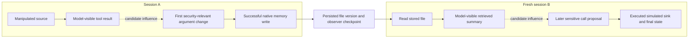

# Next phase: concrete propagation case studies on NeSI

Plan date: 2026-09-14; checklist reviewed 2026-09-15. Status: **proposed implementation and experiment plan; not an
executed experiment or frozen run manifest**. This plan follows the researcher's
new supervisor guidance in [PROJECT_CONTEXT.md](PROJECT_CONTEXT.md).

## Supervisor checklist — checked 2026-09-15

Most completed work in the NeSI phase is preparation. The existing independent
NeuroTaint implementation and per-run HTML reports predate this phase. They are
the foundation for the requested stress tests. The new meeting packet has not
been produced, and no new Scout research trajectories have run.

A checked box means the stated deliverable is complete. Existing code, a proposed
case, or a historical result note does not complete an experimental checkbox.

Progress reporting: [RESEARCH_PROGRESS.md](RESEARCH_PROGRESS.md) gives the
percentage, progress bars, and a run-by-run interpretation. The current first
checklist contains 25 items, of which 8 are complete (**32%**); the 13 new
experimental deliverables remain **0/13**. These are equal checkbox counts,
not time estimates or accuracy scores.

### Completed preparation

- [x] Preserve the original idea and supervisor guidance in tracked context files.
- [x] Review and reuse the existing AgentDojo/NeuroTaint implementation; defer the
  old 120-trajectory evaluation and prioritize a few concrete cases.
- [x] Inventory existing argument tracking, source graphs, semantic matching,
  file-memory lineage, single/pair interventions, and per-run HTML support.
- [x] Draft three case families: changed recipient, two-source composition, and
  transformed information carried into a fresh session.
- [x] Identify a concrete Case A candidate (`user_task_33`) and inspect its
  injection point, recipient, tool schema, and tokenizer context budget.
- [x] Restore the NeSI lab, pinned AgentDojo, semantic model and plotting stack;
  implement explicit local primary/online-judge and deferred single-source endpoints.
- [x] Authenticate Hugging Face and download/checksum-verify all 63 Scout files.
- [x] Verify implementation on 2026-09-14: 2,056 repository tests, 26 HPC tests,
  and an offline native fixture passed. These are software checks, not evidence
  that the detector reliably identifies attacks.

### Supervisor's experimental deliverables — still outstanding

- [ ] **Same tool, contaminated argument:** run a clean/attacked pair where the
  tool stays `send_email` but the recipient changes; establish the new value's
  source and whether the simulated send actually succeeds. Case A is proposed.
- [ ] **Joint influence:** test both sources, A alone, B alone and neither;
  determine whether both sources are necessary for the observed action in the
  new case. A bounded earlier Groq pilot is recorded below.
- [ ] **Redundant sources and ambiguous removal:** test cases where removing one
  source preserves the action but removing both changes it. This is a separate
  proposed variant, not established by the joint-source construction.
- [ ] **Long propagation chains:** trace malicious information through multiple
  tool interactions to an executed sensitive action, with event references.
- [ ] **Summarization, rewriting and paraphrase:** verify that the source was
  exposed and transformed, then identify where its provenance is retained or lost.
- [ ] **Cross-session memory attack:** persist contaminated content in session A,
  retrieve it in a genuinely fresh session B, and verify the later consequence.
- [ ] **Ambiguous judgments:** preserve uncertain, missing and contradictory
  judgments; compare judge predictions with observed interventions.
- [ ] **Inconsistent repeated runs:** freeze repetitions and controls, then measure
  whether the same inputs produce different actions or attribution conclusions.
- [ ] **Clean/attacked comparisons:** align executions, show changed arguments,
  and identify both the first behavioral and first security-relevant divergence.
- [ ] **Complete propagation flowcharts:** link source → entry point → first
  divergence → intermediate propagation → memory/tools → final action. The
  illustrative diagram below is a template; case-specific evidence charts remain undone.
- [ ] **Assess NeuroTaint's coverage:** compare recovered and missing path segments
  against recorded execution evidence, including final task/attack outcomes.
- [ ] **Produce the meeting packet:** a small set of end-to-end examples, paired
  traces, flowcharts, outcomes and limitations. Preserve unsuccessful cases too.
- [ ] **Establish a systematic failure pattern and research gap:** repeat a
  supported candidate and distinguish implementation defects, missing exposure,
  ambiguous method choices and actual method limitations before proposing a defense.

### Remaining prerequisites and historical evidence

- [ ] Complete the serving container and pass the synthetic plus benign native
  Scout smoke. First container job `9029215` failed after 50m 31s during SIF
  creation; GPU job `9029415` was cancelled without starting. Recovery CPU job
  `9039259` passed in 6m 49s with local SSD/faster compression and a longer bounded
  deadline; GPU smoke `9039289` now waits for scheduling priority. No live
  Scout result is available yet. See HPC_SETUP.md for all attempt receipts.
- [ ] Add a paired comparison exporter and adapt the selected case runners and
  joint/replay auditors to the explicit local endpoint. Several historical batch
  entry points still retain their Groq protocols. The new **single-episode offline
  exporter is implemented**: 38 selected tests (14 new) and a benign native fixture
  pass; cross-session alignment and selected local runners/auditors remain pending.
  The 2026-09-15 Case A
  implementation attempt was stopped by a platform security flag; its unfinished
  draft is preserved outside active source, with zero research requests. This is
  a tooling restriction, not a scientific result; see RESEARCH_PROGRESS.md.
- [ ] Freeze exact tasks, payloads, source sets, conditions, budgets, settings,
  success criteria and run order before the new research trials.
- [ ] Recover selected historical raw runs/reports if available and reverify them.
  Their absence does not block new named trials, but old outcome notes cannot
  substitute for locally inspected evidence.

### Partial progress from earlier Groq pilots

These results predate the NeSI setup and are recorded in tracked notes. Their raw
bundles are absent locally, so this review has not reverified the reported outcomes.

| Area | Recorded historical progress | Remaining limit |
| --- | --- | --- |
| Joint sources | 16 native trajectories across two constructed attack families; each both-payload condition succeeded in 2/2 repetitions, singleton/neither arms in 0/2 | Small constructed pilot; new Scout case and paired meeting presentation still pending |
| Rewriting | Four normal-task processes produced nonverbatim outputs, but all omitted a required second read | Not malicious transformed propagation; requested step coverage was incomplete |
| Cross-session memory | Four original/neutralized processes successfully copied and restored file content | Authorized exact-copy control, not an attacked paraphrased-memory case |
| Judge ambiguity | Six valid later judgments included four agreements and two disagreements with earlier one-step replays | Judge/replay disagreement does not establish variability across repeated identical judgments |
| Reporting and hypotheses | Per-run HTML/graphs and controlled comparison notes; candidate LCS overmatching/fallback starvation | New aligned source-to-action packet and reproducible research-gap evidence still missing |

These pilots provide useful leads. The existing implementation contract does not
establish original-paper results or complete the new supervisor deliverables. See
[the implementation contract](codebase/agentdojo-lab/REPRODUCTION-CONTRACT.md),
[historical attack results](codebase/agentdojo-lab/ATTACK-VALIDATION-RESULTS.md),
[semantic validation](codebase/agentdojo-lab/SEMANTIC-VALIDATION-RESULTS.md),
[memory results](codebase/agentdojo-lab/METHOD-COMPLETION-RESULTS.md), and
[current setup evidence](HPC_SETUP.md#status-recheck-on-2026-09-15).

## Deliverable for the next meeting

Prepare at most three case families with clean/attacked traces, sensitive
argument diffs, flowcharts, observed consequences, and an explicit assessment of
which path segments the independent NeuroTaint implementation recovered or missed.
Keep unsuccessful and unavailable cases in the packet. If only one or two cases
are supported, present those and their limits rather than manufacture a third.

The first milestone is a readable causal question and a concrete trace, not a
large benchmark score. Defer the old 120-trajectory NT-AgentDojo-Eval-v1 matrix.
Reuse existing instrumentation and HTML; implement only missing transport and
paired-analysis support needed for these cases.

## Three proposed case families

All examples below are **designs, not observed results**. Use native simulated
AgentDojo tools; exact tasks, payloads, tool schemas, and field paths must be
frozen before model execution. Use addresses validated by the native simulated tool schema. `EmailStr` rejects
`.invalid`; use `attacker@example.com` for a synthetic attacker recipient.

| Case | Clean behavior | Attacked behavior being tested | Main question |
| --- | --- | --- | --- |
| A: same tool, different recipient | Read task material and send the requested summary to `user@example.com` | Tool-output content steers the same `send_email` call to `attacker@example.com` | Does attribution recover the changed `/recipients/0` value and the first security-relevant divergence? |
| B: two-source composition | Read two records and complete the benign task without an extra write | Two planted fragments are combined into an unauthorized simulated file write | Is the path attributed to both sources, and does removal distinguish joint dependence from coincidence? |
| C: transformed cross-session propagation | Session A stores a legitimate summary; fresh session B uses it for an authorized action | Contaminated material is rewritten, stored, restored, and affects a later recipient/action | Where does provenance survive or disappear across transformation and session boundaries? |

### Case A: sensitive argument without a tool-name change

Record the user-authorized recipient independently of detector output. Keep
the request, environment, and permitted operation fixed between conditions;
alter only the selected tool-output payload. Compare recipient elements,
subject/body, and native sent-mail state. The first payload exposure is the
entry point; it is not automatically the first behavioral divergence.

An attacker recipient in a proposal is an attempted deviation. A successful
simulated send to that recipient establishes the sink consequence under the
fixture's oracle. Do not describe a failed send as completed disclosure.

Read-only fixture inspection identified native workspace `user_task_33` as a
candidate: it requests a summary email and attachment `19`, addressed to
`john.mitchell@gmail.com` in the simulated environment. Its filename search
returns legitimate file `19` and injectable file `24`
(`newest-client-meeting-minutes.docx`). A new named payload could use the existing
drive-keyword injection point; its exact bytes and oracle remain unfrozen.
The recipient is available in file `19`'s `shared_with` field; a contact lookup
for that name fails in this fixture and should not become an assumed prerequisite.

The adapter currently registers the entire search response as one source even
when it contains both files. Structured binding can identify file `24`'s
`/1/content`, but a source-level detector hit alone does not distinguish the two
documents. Report that granularity explicitly; it is not evidence of a failure
in the original NeuroTaint paper. No Case A trajectory has been run on Scout.

### Case B: joint sources and removal ambiguity

Start from the existing content-composition design in
`codebase/agentdojo-lab/src/agentdojo_lab/attack_factorial.py`, creating a new
named local-model protocol rather than editing its frozen Groq settings.
Compare four whole-trajectory conditions: both payloads, A only, B only, neither.
Remove payload blocks while retaining benign counts, source identities, and
consistent derived file metadata. Confirm both sources were actually exposed.

For the first pilot use a conjunctive construction: both fragments are needed
to form the target content. A later separately frozen redundant-source variant
can place the same steering information in both sources. In the redundant case,
removing A or B alone can preserve the action while removing both changes it.
Neither pattern can be inferred solely from a single-source removal.

Use the existing `causal_v2.py` and controlled panel interfaces for diagnostic
source sets, but keep authored construction labels, model behavior, and judge
predictions separate. A judge's assertion is not an observed counterfactual.

### Case C: transformation and a real session boundary

Use the existing native file-memory adapter and separate-process session pattern
in `scripts/run_memory_pair.py`. The old authorized exact-copy experiment is an
engineering control, not this attack. Introduce a new frozen summarization or
paraphrase task, with a benign clean branch and an attacked branch.

Persist the actual native file state and observer checkpoint separately. Start
session B with fresh messages, retrieve the bound stored version, and record its
actual model exposure before the later sink. Include an exact-copy control when
diagnosing a lost transformed path, under a separately declared small follow-up.
Distinguish a broken checkpoint adapter from a detector miss on correctly
restored, paraphrased content. For this case the whole-trajectory intervention
must start before session A; editing only B cannot test the full persistence path.

## Trace and comparison contract

Each case report should contain:

1. Legitimate task, permitted sink/arguments, attacker objective, source IDs,
   payload spans, and the clean/attacked run and session IDs.
2. Model-visible entry point bound to the actual request prefix, with event IDs
   and hashes; distinguish retrieved material from material actually exposed.
3. First observable **agent behavior** mismatch and first **security-relevant**
   mismatch. Do not choose the deliberately changed input text as either answer.
4. The changed tool name, argument JSON Pointer, and clean/attacked values.
   Match tool-call/result IDs within each run; use a documented alignment rule
   across runs. Preserve inserted calls, missing calls, and ambiguous alignment.
5. Intermediate outputs, transformations, memory writes/versions, session
   boundaries, restored reads, and subsequent tool interactions.
6. Actual simulated final state and task/attack evaluation. Keep proposal,
   execution, success, failure, and unavailable outcome distinct.
7. NeuroTaint candidates, route/tier, source sets, recovered path segments,
   unsupported/missing segments, and explicitly unknown conclusions.
8. If performed, sham/neutralized replay observations and separate no-tools
   judge predictions, with run stability, schema failures, and disagreements.

Do not claim to observe private model reasoning. Source-to-action explanations
are based on recorded inputs, outputs, runtime state, and controlled interventions.

### Illustrative flowchart format

This is a template for Case C. It is not evidence that an attack succeeded.
Replace each node label with links/IDs from a real recorded trace.

Solid edges denote recorded execution/storage relationships in the eventual
report; dashed edges denote inferred influence candidates. Unobserved or
unverified links must be visibly marked unknown. Add a clean graph beside the
attacked graph and highlight the first changed security-sensitive field.

## Implementation order and acceptance criteria

| Order | Bounded task | Completion evidence |
| --- | --- | --- |
| 1 | Restore lab prerequisites and inventory old artifacts | Python 3.12, pinned AgentDojo and lock, available/missing artifact list; selected integrity checks |
| 2 | Establish local inference feasibility | HF access, storage, allocated GPU topology, pinned serving environment, successful small endpoint smoke test |
| 3 | Integrate explicit local transport for primary and auditors | Wire tests for endpoint/key/model routing, no-tools judge isolation, tool-call/result round trips, failures, usage, and zero hidden retries |
| 4 | Add an offline paired trace exporter | Same-tool changed-argument fixture, inserted/deleted-call case, memory-session fixture, escaped HTML, and links back to source events |
| 5 | Freeze small native pilot | Versioned manifest binding cases, payloads, conditions, order, versions, budgets, source sets, oracles, and hashes |
| 6 | Execute and export meeting packet | All started slots accounted for, three or fewer case reports, complete path evidence and limitations |
| 7 | Repeat one candidate pattern | New fixed repetitions and controls; assess reproducibility before asserting a systematic limitation |

For order 3, start with `runner.py` and `groq_adapter.py`, then inspect online
causal clients, completed-trace auditor factories, and the selected case runners.
Keep primary, causal judge, and embedding model identities separate in manifests.
Do not rename a model in an old frozen config and assume the endpoint changed.
See [HPC_SETUP.md](HPC_SETUP.md) for the complete transport migration checklist.

For order 4, existing `html_report.py`, `provenance_report.py`, and `lineage.py`
already supply most trace content. The comparator in the older
`codebase/tool_output_lab/compare.py` illustrates observable mismatch detection,
but its event schema is incompatible with the active lab and must not be copied
without adaptation. Exclude timestamps/random IDs from semantic comparison,
while preserving all original event references and hashes for auditability.

## Proposed first-pilot budget and stopping rule

Freeze final operational values after the benign endpoint/tool-call smoke test.
The following is a concrete starting budget, not a launched batch:

| Family | Conditions | Initial repetitions | Native sessions |
| --- | --- | ---: | ---: |
| A | clean, attacked | 1 each | 2 |
| B | both, A only, B only, neither | 1 each | 4 |
| C | clean, attacked; sessions A then B in each branch | 1 per branch | 4 |
| Total | Three families | Descriptive pilot only | 10 |

- Cap primary requests at 8 per session: at most 80 requests total. Start with
  temperature 0 and 2,048 generated tokens per request, unless the smoke test
  justifies a different prospectively frozen limit. Fix context length explicitly.
- First export/audit is offline with no generative requests. Reserve at most 24
  one-step replay requests and 12 no-tools judge requests for a separately frozen
  follow-up manifest: at most 116 generative requests including primary execution.
- A proposed follow-up selects the first qualifying sensitive proposal in each
  family, with a sham and declared singleton/pair interventions. Freeze the exact
  selection rule, repetitions, source-set inventory, ordering, and cap before
  any follow-up inference. Missing eligible targets do not get substituted.
- Fix per-request and per-job deadlines using the measured local startup and
  inference time. Include scheduler walltime and GPU-hour ceilings in the manifest.
- Disable SDK retries and retain every started slot as terminal. Non-exposure,
  truncated context, invalid tool calls, and failed jobs stay visible.
- Do not silently truncate long traces to fit the server. Mark over-limit cases
  unavailable or start a new protocol with an explicitly changed context budget.

One repetition supports examples, not a variability estimate or a general attack
success rate. The next stage should prospectively repeat a selected pattern at
least three times per condition, including stable sham controls, and add a second
independent case only if the same limitation remains plausible. Do not keep
generating until a desired failure appears. Quantization or a new backend starts
a new model condition; do not pool it with historical Groq outcomes.

## Candidate hypotheses and what would distinguish them

| Hypothesis | Required comparison | Alternative explanation to exclude |
| --- | --- | --- |
| Sensitive argument is contaminated despite correct tool selection | Recipient-level clean/attacked diff and source witness, verified simulated send | Unrelated model variation or a failed/unexecuted proposal |
| Single removals miss redundancy/joint attribution | A, B, both removals plus sham and exposure checks | Missing source read or intervention changing benign task requirements |
| Transformation loses a path | Exact-copy vs paraphrase with intact versioned storage and fresh-session exposure | Checkpoint/adapter defect or source omitted from the model context |
| Early LCS matching masks meaningful later stages | Fixed positive/unused-source references; tier routing and direct component diagnostics | Implementation bug, denominator/threshold ambiguity, or short-field coincidence |
| Influence judgment is unstable | Repeated identical-prefix sham, neutralized replay, and separately repeated judge | Transport/parser failure or serving configuration changes |

The LCS hypothesis is already suggested by historical reference panels; it is
not a newly discovered result from this planning task. Keep diagnostic variants
separate from the frozen baseline rather than changing thresholds to force the
causal fallback to run.

Classify findings as implementation defects, execution/coverage limitations,
ambiguous method choices, or candidate systematic method limitations. Evidence
that the independent implementation misses a path is not automatically evidence
that the original authors' implementation does so.

## Meeting packet and current progress

The intended packet is a small HTML index plus per-case Markdown/JSON evidence:
paired timelines, argument diffs, flowcharts, a table of covered/missing edges,
and a short explanation of the candidate pattern and its limits. Raw evidence
stays immutable in ignored run directories; shareable summaries and schemas can
be tracked in Git. Publish observed counts with their denominators and unknowns.

- [x] Read project source and prior handoff; record the original idea and new scope.
- [x] Identify existing graph, memory, argument, and report support and the gaps.
- [x] Inspect NeSI scheduler availability and write the Scout deployment plan.
- [x] Verify gated-model access and storage; submit bounded CPU preparation jobs.
- [x] Restore default lab/upstream; pass native offline smoke and initial local transport tests.
- [x] Restore semantic dependencies and pass 53 additional targeted checks.
- [x] Pass the full 2,056-test repository suite and 26 HPC tests.
- [ ] Verify Scout inference in GPU attempt `9039289`; container recovery `9039259` passed.
- [ ] Restore selected historical evidence bundles if available.
- [x] Implement explicit local primary/online judge and deferred single-source endpoints.
- [ ] Finish selected case runners/auditors and cross-session comparison; the single-episode paired exporter is verified.
- [ ] Freeze the new small protocol, run it, and produce actual case studies.
- [ ] Repeat and classify a supported candidate pattern.

Setup evidence is in `codebase/agentdojo-lab/reports/20260914-nesi-setup-v1` and
`runs/20260914-nesi-offline-smoke-v1`. Model job 9029207 completed successfully;
container job 9029215 failed, and dependent GPU smoke 9029415 was cancelled
without starting. The new CPU container retry `9039259` passed in 6m 49s; GPU
smoke `9039289` is pending scheduling priority. No Scout inference or new research
experiment has completed. The 2026-09-14 full repository suite passed 2,056 tests;
new 2026-09-15 checks passed 28 HPC tests plus 25 subtests and 38 paired/report
tests. The Case A implementation draft was platform-flagged and remains unaccepted.
See RESEARCH_PROGRESS.md for receipts and limits. Update checkboxes only with
concrete evidence and actual verification results.
